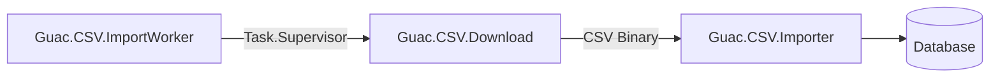

# Guac

Welcome to Guac, an Elixir/Phoenix based starting point for web apps dedicated to San Francisco food truck data.

Live demo: [https://guac.fly.dev/](https://guac.fly.dev/)
## CSV Import

### ImportWorker

Works in tandem with an Elixir `Task.Supervisor` to facilitate child process CSV imports. Ultimately, this could be promoted to something more robust, like an Oban worker.

### Guac.CSV.Download

Responsible for downloading the CSV binary to a tmp file path, via [Briefly](https://github.com/CargoSense/briefly).

### Guac.CSV.Importer

Parses the CSV binary, via [NimbleCSV](https://github.com/dashbitco/nimble_csv), then forwards the reduction to our applicaton context for persistence.

## MacOS (non-Docker) Requirements

* Postgres 14+
* PostGIS extension
* Elixir 1.14+

## Recommended Local Setup

Using `asdf` package manager, install both Postgres and Elixir, as found in the `asdf` instructions:

[ASDF Getting Started](https://asdf-vm.com/guide/getting-started.html)

Using `brew` package manager, install PostGIS as follows: `brew install postgis`

### Starting the Phoenix web server

To start your server:

  * Install dependencies with `mix deps.get`
  * Create and migrate your database with `mix ecto.setup`
  * Start Phoenix endpoint with `mix phx.server` or inside IEx with `iex -S mix phx.server`
  * Via `iex` console, seed the latest data with the following: `Guac.CSV.ImportWorker.perform`
  * Navigate to [http://localhost:4000](http://localhost:4000)

